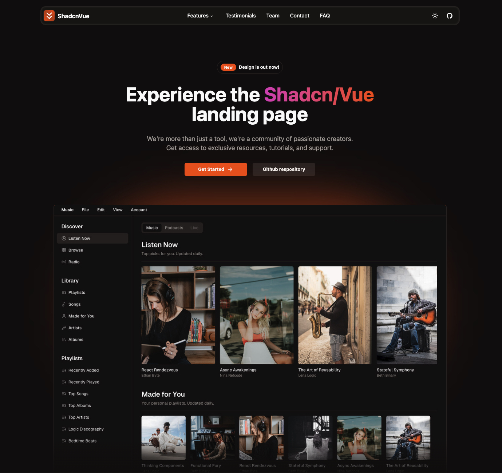

# Shadcn/Vue Landing Page Template

## <a href="https://www.shadcn-vue.com/" target="_blank">Shadcn-Vue</a> + <a href="https://vuejs.org/" target="_blank">Vue.js</a> + <a href="https://www.typescriptlang.org/" target="_blank">TypeScript</a> + <a href="https://tailwindcss.com/" target="_blank">Tailwind</a>.


Live demo is now available: <a href="https://shadcn-vue-landing-page.vercel.app" target="_blank">Live Demo</a>

## Sections

- [x] Navbar
- [x] Sidebar(mobile)
- [x] Hero
- [x] Sponsors
- [x] Benefits
- [x] Features
- [x] Services
- [x] HowItWorks
- [x] Testimonials
- [x] Pricing
- [x] Frequently Asked Questions(FAQ)
- [x] Team
- [x] Community
- [x] Contact
- [x] Footer

## Features

- [x] Fully Responsive Design
- [x] User Friendly Navigation
- [x] Dark Mode
- [x] Meta tags

## How to install

1. Clone this repositoy:

```bash
git clone https://github.com/leoMirandaa/shadcn-vue-landing-page.git
```

2. Go into project

```bash
cd shadcn-vue-landing-page
```

3. Install dependencies

```bash
npm install
```

4. Run project

```bash
npm run dev
```


App.vue

import Benefits from "./components/Benefits.vue";
import Features from "./components/Features.vue";
import Services from "./components/Services.vue";
import HowItWorks from "./components/HowItWorks.vue";
import Sponsors from "./components/Sponsors.vue";
import Testimonials from "./components/Testimonials.vue";
import Team from "./components/Team.vue";
import Pricing from "./components/Pricing.vue";
import Community from "./components/Community.vue";
import Contact from "./components/Contact.vue";
import FAQ from "./components/FAQ.vue";


Navbar.vue

  NavigationMenuTrigger,